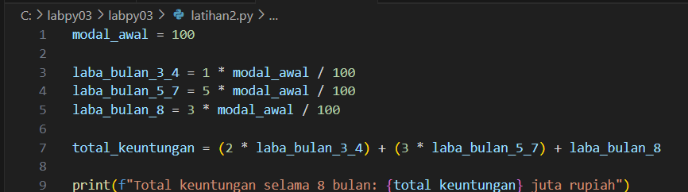
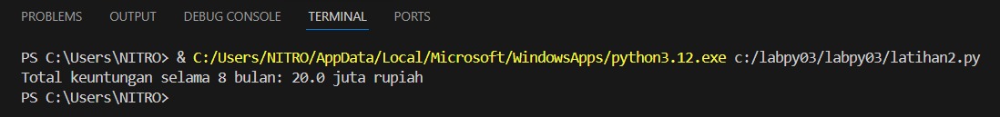

# labpy03

# Latihan 1.py 
  
## Langkah - langkah penyelesaian :
  1 . Impor Modul random
      
 
  2 . Input dari User
      
  
  3 . Looping untuk mencetak bilangan acak  < 0.5
      
  
  4 . Output Code:
      

## Penjelasan Code: 
  1 . from random import random: Mengimpor fungsi random() untuk menghasilkan bilangan acak.
  2 . n = int(input(...)): Menerima input dari pengguna dan memastikan input tersebut bertipe integer.
  3 . count = 0: Penghitung bilangan acak valid yang sudah dicetak.
  4 . while count < n:: Loop berjalan sampai kita mendapatkan n bilangan acak yang memenuhi syarat.
  5 . a = random(): Menghasilkan bilangan acak antara 0.0 hingga 1.0.
  6 . if a < 0.5:: Hanya cetak bilangan jika lebih kecil dari 0.5.
  7 . count += 1: Jika syarat terpenuhi, penghitung dinaikkan agar loop tidak berjalan tanpa henti.

## Alur algoritma :
  1 . Inisialisasi penghitung (count) menjadi 0 untuk melacak jumlah bilangan valid yang sudah dicetak.
  2 . Input nilai n dari pengguna (jumlah bilangan acak yang ingin dihasilkan).
  3 . Mulai while loop:
  4 . Kondisi: Loop berjalan selama jumlah bilangan yang dicetak (count) kurang dari n.
  5 . Di dalam while loop:
      -Generate bilangan acak dengan random() (nilai antara 0.0 – 1.0).
      -Periksa kondisi: Apakah bilangan acak tersebut < 0.5?
      -Jika ya, cetak bilangan dan tambahkan 1 ke count.
      -Jika tidak, lanjutkan ke iterasi berikutnya (tanpa menambah count).
  6 . Selesai: Loop berhenti ketika n bilangan yang memenuhi syarat sudah dicetak.

# Latihan 2.py

## Langkah - langkah penyelesaian :
  1 . Identifikasi Periode Laba:
        -Bulan 1 dan 2: 0% laba → Tidak ada keuntungan.
        -Bulan 3 dan 4: 1% laba per bulan → 1% dari 100 juta = 1 juta per bulan.
        -Bulan 5, 6, dan 7: 5% laba per bulan → 5% dari 100 juta = 5 juta per bulan.
        -Bulan 8: 3% laba → 3% dari 100 juta = 3 juta.
    
  2 . Hitung Total Keuntungan per periode:
        -Bulan 1 dan 2: 0 juta (karena laba = 0%).
        -Bulan 3 dan 4: 2 bulan × 1 juta = 2 juta.
        -Bulan 5, 6, dan 7: 3 bulan × 5 juta = 15 juta.
        -Bulan 8: 3 juta.

  3 . Total keuntungan selama 8 Bulan:
        2 Juta + 15 Juta + 3 Juta = 20 Juta
 
  4 . Implementasi Code: 
      

  5 . Output Code:
      

## Penjelasan Code:
  1 . modal_awal = 100: Menyimpan modal awal sebesar 100 juta.
  2 . Laba per bulan dihitung dengan rumus persentase: (persentase * modal_awal) / 100.
  3 . Total keuntungan dihitung dengan mengalikan laba per bulan dengan jumlah bulan yang relevan.
  4 . Hasil akhirnya dicetak dalam satuan juta rupiah.

## Alur algoritma:
  1 . Inisialisasi modal awal sebesar 100 juta rupiah.
  2 . Tentukan persentase laba untuk setiap periode:
        -Bulan 1 dan 2: Tidak ada keuntungan (laba = 0%).
        -Bulan 3 dan 4: Laba = 1% per bulan.
        -Bulan 5 hingga 7: Laba = 5% per bulan.
        -Bulan 8: Laba = 3%.
  3 . Hitung laba tiap periode:
        -Laba bulan 3 dan 4: 1% x 100 Juta = 1 Juta per Bulan 
        -Laba bulan 5,6 dan 7 : 5% X 100 Juta = 5 Juta pe Bulan
        -Laba bulan 8: 3% X 100 = 3 Juta per Bulan 
  4  . Hitung total keuntungan:
        -Total laba = (2 × 1 juta) + (3 × 5 juta) + (1 × 3 juta).
        -Total laba = 2 juta + 15 juta + 3 juta = 20 juta rupiah.
  5  . Cetak hasil: Total keuntungan selama 8 bulan adalah 20 juta rupiah.
  
      