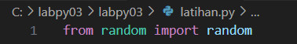
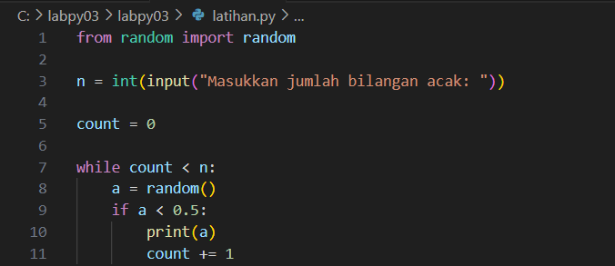
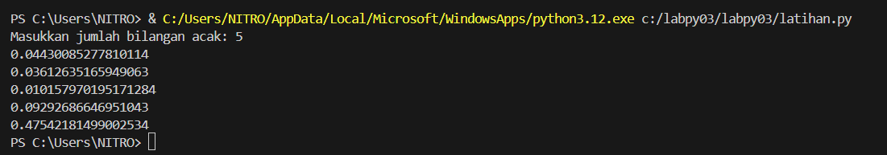

# labpy03

# Latihan 1.py 
  
  Langkah - langkah penyelesaian :
  1 . Impor Modul random
      
 
  2 . Input dari User
      
  
  3 . Looping untuk mencetak bilangan acak  < 0.5
      
  
  4 . Output Code:
      

      